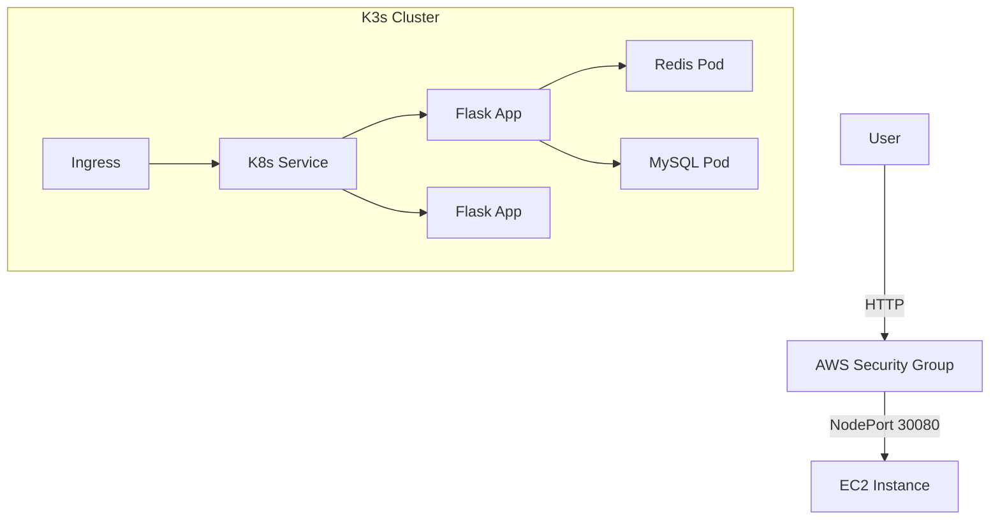

# Web-based SSIS (DevOps Project)

A Flask-based Student Information System (SSIS) modernized with a full DevOps pipeline including Docker, Terraform, Ansible, Kubernetes, and CI/CD.

## 🚀 Project Overview

This project demonstrates the transformation of a legacy monolithic application into a scalable, cloud-native architecture.

**Key Features:**
*   **Containerization**: Multi-stage Docker builds for optimized images.
*   **Infrastructure as Code**: Terraform for AWS provisioning (VPC, EC2, S3).
*   **Configuration Management**: Ansible for server setup (K3s, Docker).
*   **Orchestration**: Kubernetes (K3s) for managing Flask, MySQL, and Redis.
*   **CI/CD**: GitHub Actions for automated testing, building, and deployment.
*   **Monitoring**: Prometheus and Grafana for observability.

## 🛠️ Tech Stack

*   **App**: Python (Flask), MySQL, Redis
*   **Container**: Docker, Docker Compose
*   **Infrastructure**: Terraform (AWS)
*   **Config Config**: Ansible
*   **Cluster**: K3s (Lightweight Kubernetes)
*   **CI/CD**: GitHub Actions

## 🏃 Getting Started (Local)

1.  **Clone the repository**:
    ```bash
    git clone https://github.com/Subhan-8/Mid-Devops.git
    cd Mid-Devops
    ```

2.  **Run with Docker Compose**:
    ```bash
    docker-compose up --build
    ```

3.  **Access the App**:
    *   Web: `http://localhost:5000`
    *   phpMyAdmin: `http://localhost:8080`

## ☁️ Deployment Architecture



## 🔄 CI/CD Pipeline

The project uses GitHub Actions (`.github/workflows/ci-cd.yml`) with the following stages:

1.  **Build & Test**: Runs `pytest`, `flake8`, `safety` checks.
2.  **Build & Push**: Builds Docker image -> Docker Hub (`subhan45/ssis-web`).
3.  **Infrastructure**: runs `terraform plan` to validate infrastructure changes.
4.  **Deploy**: Connects via SSH and runs `kubectl apply`.
5.  **Smoke Test**: Verifies application health via `curl`.

## 📊 Monitoring

*   **Prometheus**: Metrics collection (Port 30090).
*   **Grafana**: Visual dashboards (Port 30091).
*   **Node Exporter**: Sever-level metrics.
